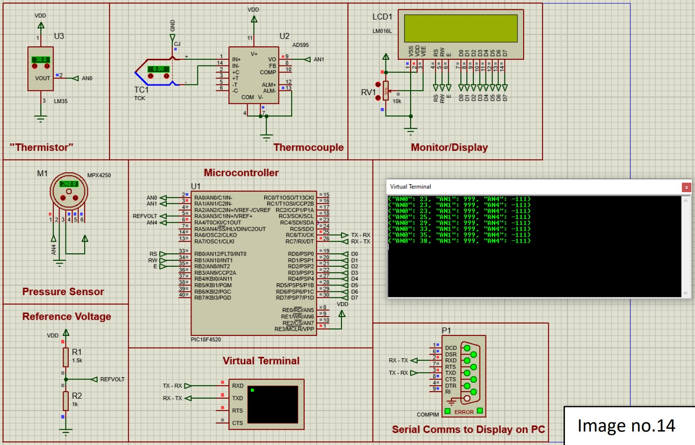
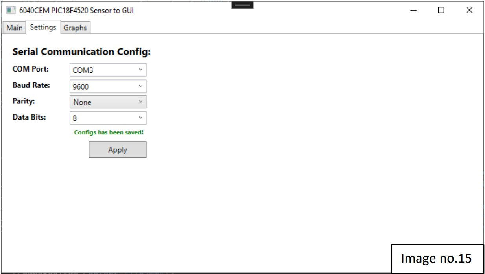
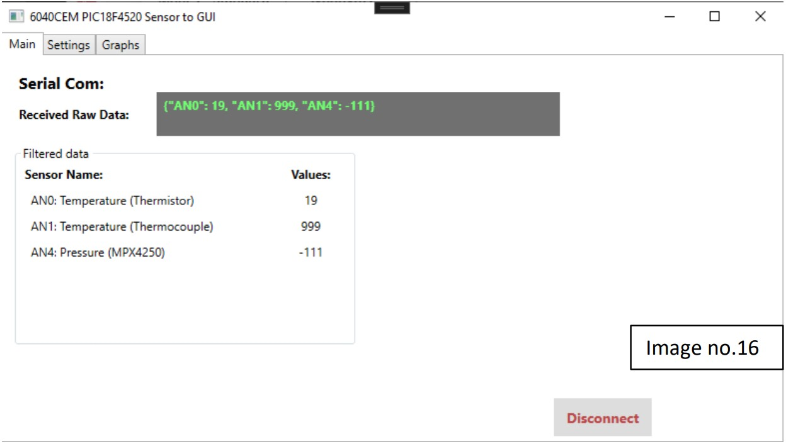
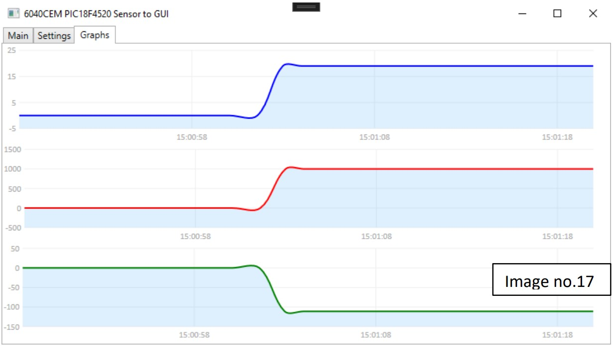
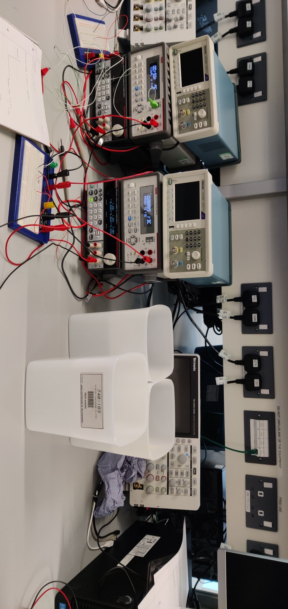
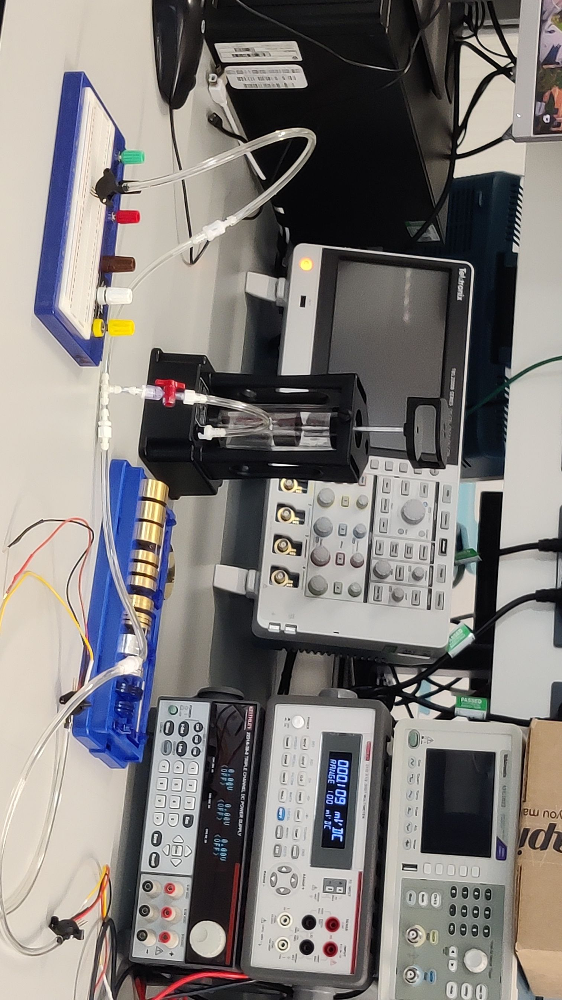

# Embedded Thermodynamic Measurement System with PIC18: Embedded Software Engineering Project

## Introduction

This repository is dedicated to my dissertation project at the university, where I developed an embedded system for measuring thermodynamic variables using a PIC18 microcontroller. The project embodies a blend of hardware interfacing and software development, showcasing my skills as a software engineer in embedded systems design.

## Project Overview

### Embedded System Design
- **Microcontroller Utilization**: The heart of the project, a PIC18 microcontroller, is tasked with the precise collection of heat and pressure data.
- **Sensor Integration**: Demonstrates the interfacing of multiple sensors with the microcontroller to capture real-time thermodynamic data.

### Software Engineering
- **GUI Development**: Employed WPF (Windows Presentation Foundation) to create a dynamic and user-friendly interface for data visualization.
- **Data Visualization**: Integrated LiveCharts for real-time graphical representation of the collected data, enhancing the interpretability of complex thermodynamic measurements.

## Visual Documentation

To provide a comprehensive understanding and insight into the project, the repository includes a variety of visual materials:
- **Proteus Schematics**: Detailed diagrams illustrating the electronic setup and sensor configuration.

- **GUI Snapshots**: Screenshots displaying the main interface and the graphical presentation of data.

- **Experimental Setup**: Photographs from the experiments, offering a glimpse into the practical application of the project.

## Objectives and Learning Outcomes

This project not only served as a practical application of embedded systems and software engineering principles but also as a significant learning experience, enhancing my capabilities in:
- Designing and implementing embedded systems for real-world applications.
- Developing software solutions for complex data visualization challenges.
- Bridging the gap between theoretical knowledge and its practical application in the field of thermodynamics.

## Conclusion

The Embedded Thermodynamic Measurement System with PIC18 is a testament to my dedication and skills in software engineering and embedded systems. It stands as a pivotal project in my academic portfolio, highlighting my ability to tackle complex engineering challenges through innovative solutions.

---
